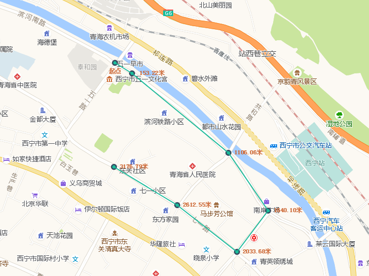
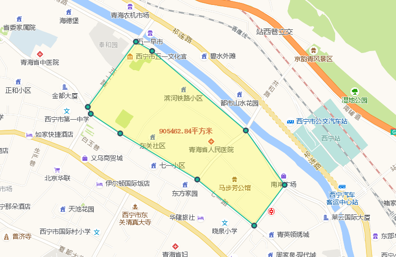

### GeometryService实现测量功能
几何服务（GeometryService）可以用这个类实现测量直线的距离，形状的缓冲区分析，判断两个形状之间的关系（相交，相离等等），两个形状求交，对形状的裁剪的图形操作。
<!-- more -->
#### 测量功能的具体代码
``` html 
<!DOCTYPE html>
<html lang="en">
<head>
    <meta charset="UTF-8">
    <title>Title</title>
    <link rel="stylesheet" type="text/css" href="http://120.77.215.143:6012/arcgis_js_api/library/3.21/3.21/dijit/themes/tundra/tundra.css"/>
    <link rel="stylesheet" type="text/css" href="http://120.77.215.143:6012/arcgis_js_api/library/3.21/3.21/esri/css/esri.css"/>
    <script type="text/javascript" src="http://120.77.215.143:6012/arcgis_js_api/library/3.21/3.21/init.js"></script>
    <script src="https://cdn.bootcss.com/jquery/3.3.1/jquery.min.js"></script>
</head>
<body>
<div id="map" style="height: 700px;width: 100%"></div>
<button id="JSarea">测量面积</button>
<button id="JSline">测量距离</button>
<button id="JSclear">清除</button>
</body>
<script>

    require([ "esri/map","extLayers/gaodeLayer","esri/layers/GraphicsLayer"
    ],function (Map,gaodeLayer,GraphicsLayer) {
        var map=new Map("map",{
            logo:false,
            center: [101.778112, 36.617042],
            zoom:13
        });
        var gaodelayer=new gaodeLayer();
        map.addLayer(gaodelayer);
            var disFun =false;//距离测量
            var areaFun = false;//面积测量
            var inputPoints = [];//存储生成点的集合
            var totleDistance = 0.0;//总距离
            require(["esri/toolbars/draw",
                "esri/symbols/SimpleLineSymbol","esri/symbols/SimpleFillSymbol",
                "esri/Color","esri/layers/GraphicsLayer","esri/graphic",
                "esri/symbols/Font", "esri/symbols/TextSymbol", "esri/symbols/SimpleMarkerSymbol",
                "esri/tasks/LengthsParameters", "esri/tasks/GeometryService","esri/geometry/Polyline",
                "esri/tasks/AreasAndLengthsParameters","esri/geometry/Point"],
                    function (Draw,SimpleLineSymbol,SimpleFillSymbol,Color,GraphicsLayer,
                              Graphic,Font,TextSymbol,SimpleMarkerSymbol,LengthsParameters,GeometryService,
                              Polyline,AreasAndLengthsParameters,Point) {
                        var  measureLayer=new GraphicsLayer();
                        map.addLayer(measureLayer);
                        var toolbar = new Draw(map);
                        var startFont = new Font('12px').setWeight(Font.WEIGHT_BOLD);//定义文字样式
                        //定义标记点样式
                        var makerSymbol=new SimpleMarkerSymbol({
                            "color": [27,188,155,255],
                            "size": 7,
                            "type": "esriSMS",
                            "style": "esriSMSCircle",
                            "outline": {
                                "color": [52,73,94,255],
                                "width": 2,
                                "type": "esriSLS",
                                "style": "esriSLSSolid"
                            }
                        });
                        var geometryService =new GeometryService("http://120.77.215.143:6080/arcgis/rest/services/Utilities/Geometry/GeometryServer");
                        $("#JSarea").on("click",function () {
                            areaFun=true;
                            disFun=false;
                            toolbar.activate(Draw.POLYGON);//画面
                        });
                        $("#JSline").on("click",function () {
                            disFun=true;
                            areaFun=false;
                            toolbar.activate(Draw.POLYLINE);//绘制折线
                        });
                        $("#JSclear").on("click",function () {
                            clearAction();
                        });
                        map.on("click",function (evt) {
                           // console.log(evt);
                            if(disFun){
                                inputPoints.push(evt.mapPoint);
                                var  textSymbol;
                                if(inputPoints.length ===1){
                                    textSymbol = new TextSymbol("起点",startFont,new Color([204,102,51]));
                                    textSymbol.setOffset(0,-20);
                                    measureLayer.add(new Graphic(evt.mapPoint,textSymbol));
                                }
                                if(inputPoints.length>=2){
                                    //    设置距离测量的参数
                                    var  lengthParams = new LengthsParameters();
                                    lengthParams.calculationType = 'preserveShape';
                                    lengthParams.lengthUnit = GeometryService.UNIT_METER;//单位米
                                    var p1 = inputPoints[inputPoints.length-2];
                                    var p2 = inputPoints[inputPoints.length-1];
                                    if(p1.x ===p2.x &&p1.y===p2.y){
                                        return;
                                    }
                                    var polyline = new Polyline(map.spatialReference);
                                    polyline.addPath([p1,p2]);
                                    lengthParams.polylines=[polyline];
                                    // 根据参数，动态的计算长度
                                    geometryService.lengths(lengthParams,function (dis) {
                                        console.log(dis);
                                        var _distance = dis.lengths[0];
                                        totleDistance+=parseFloat(_distance);//计算总长度
                                        var beetwentDistances = totleDistance.toFixed(2)+"米";
                                        var tdistance = new TextSymbol(beetwentDistances,startFont,new Color([204,102,51]));
                                        tdistance.setOffset(40,-3);
                                        measureLayer.add(new Graphic(p2,tdistance));
                                    });
                                }
                                measureLayer.add(new Graphic(evt.mapPoint,makerSymbol));//添加样式点
                            }else if(areaFun){
                                measureLayer.add(new Graphic(evt.mapPoint,makerSymbol));
                            }
                        });

                        //触发完成的事件
                        toolbar.on("draw-end",function (evt) {
                           // console.log(evt);
                            if(disFun||areaFun){
                                var geometry=evt.geometry;
                                var symbol = null;
                                switch(geometry.type){
                                    case "polyline":
                                        symbol  = new SimpleLineSymbol(SimpleLineSymbol.STYLE_SOLID,
                                                new Color([27,188,155,1]),2);
                                        break;
                                    case "polygon":
                                        symbol = new SimpleFillSymbol(SimpleFillSymbol.STYLE_SOLID,
                                                new SimpleLineSymbol(SimpleLineSymbol.STYLE_SOLID,new Color([27,188,155,1]),2),
                                                new Color([255,255,0,0.25]));
                                        break;
                                }
                                var graphic=new Graphic(geometry,symbol);
                                measureLayer.add(graphic);
                                if(disFun){
                                    inputPoints.splice(0,inputPoints.length);//删除数组中的所有元素
                                    totleDistance =0.0;//清空距离值
                                    disFun = false;
                                }else if(areaFun){
                                    var areasAndLengthParams = new AreasAndLengthsParameters(); //计算面积和周长的参数
                                    areasAndLengthParams.lengthUnit = GeometryService.UNIT_METER;//设置距离单位
                                    areasAndLengthParams.areaUnit=geometryService.UNIT_SQUARE_METERS; //平方米
                                    areasAndLengthParams.calculationType="preserveShape";
                                    geometryService.simplify([geometry],function (simplifiedGeometries) {
                                        areasAndLengthParams.polygons=simplifiedGeometries;
                                        geometryService.areasAndLengths(areasAndLengthParams,function (result) {
                                           // console.log(result);
                                            var font =new Font("14px",Font.STYLE_NORMAL,Font.VARIANT_NORMAL,Font.WEIGHT_BOLDER);
                                            var areaResult = new TextSymbol(parseFloat(result.areas[0]).toFixed(2) + "平方米",font,new Color([204,102,51]));
                                            var spoint = new Point(geometry.getExtent().getCenter().x,geometry.getExtent().getCenter().y,map.spatialReference);
                                            measureLayer.add(new Graphic(spoint,areaResult));//在地图上显示测量的面积
                                        })
                                    });
                                    areaFun=false;
                                }
                            }
                            toolbar.deactivate();//撤销地图绘制功能
                        });
                        //清除功能
                        function clearAction() {
                            disFun=false;
                            inputPoints.splice(0,inputPoints.length);//删除数组中的所有元素
                            totleDistance =0.0;//清空距离值
                            areaFun=false;
                            toolbar.deactivate();
                            map.setMapCursor("default");
                            measureLayer.clear();
                        }
            })
    })
</script>
</html>
```
#### 效果图
<div  align="center">
</div>

<div  align="center">
</div>

### 