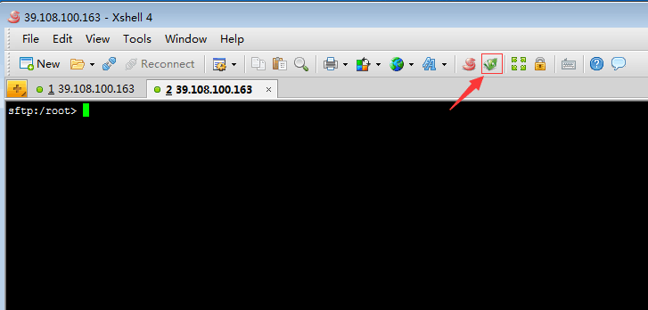
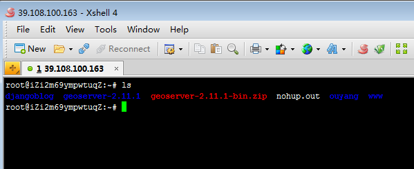
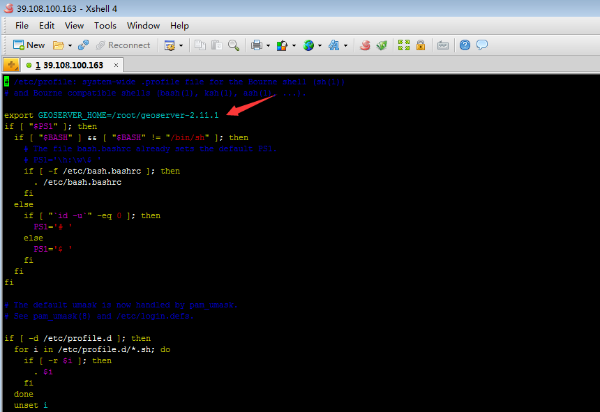

### 下载geoserver
去[官网下载](http://geoserver.org/)你喜欢的版本。
### 上传到ubuntu
用Xshell登录到服务器，然后使用sftp将下载的文件上传到root目录下。
<!-- more -->

将你要上传的文件拉到这里面来就行了。
### 解压geoserver
安装unzip 
`apt-get install unzip`
解压zip文件
`unzip 压缩文件名.zip`

这里可以看到上传过来的zip和解压之后的geoserver-2.11.1
### 安装java环境
1.添加仓库源`add-apt-repository ppa:webupd8team/java`之前可能需要安装依赖包。
2.更新软件包列表`apt-get update`
3.安装JDK `apt-get install oracle-java8-installer`
4.查看java版本，看看是否安装成功`java-version`
### 设置GEOSERVER_HOME环境变量
`vi /etc/profile` 添加路径   

保存修改重新生效`source /etc/profile`
### 启动geoserver
启动：` nohup ./startup.sh &`
关闭：`./shutdown.sh`
[访问试试](http://39.108.100.163:8080/geoserver/web/)

