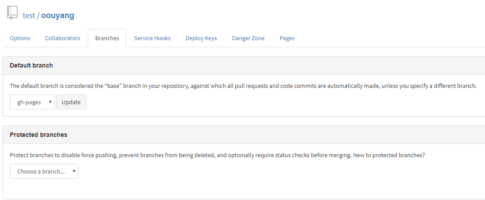

### git服务器
github上传和拉取代码速度是比较慢的，在Github上创建一个私有仓库是收费的。GitBucket是一个开源的代码管理仓库，就像GitHub一样。
<!-- more -->
### 下载并上传
选择版本，下载gitbucket.war[下载链接](https://gitbucket.github.io)
使用Xftp将war上传到ubuntu服务器上。
### 安装gitbucket
首先查看是否安装java环境。[安装java环境](https://ouyangresume.github.io/2018/06/15/ubuntu%E5%AE%89%E8%A3%85geoserver/#more)
找到你上传过来的war。执行`nohup java -jar gitbucket.war`
### 验尸
[http://39.108.100.163:8080](http://39.108.100.163:8080)
我已经创建一个游客账号，可以查看一些公共项目。
username：test
password：qwer
### 开启pages服务
1.下载gitbucket-pages-plugin插件[jar地址](https://github.com/gitbucket/gitbucket-pages-plugin)
2.将jar文件复制到<GITBUCKET_HOME>/plugins/（GITBUCKET_HOME默认为~/.gitbucket）
查找plugins文件夹在ubuntu上的哪个位置`find / -name 'plugins' -type d `
用xftp拖到plugins目录下。
3.重新启动gitbucket`nohup java -jar gitbucket.war --port 8088`
这里设置的端口号似乎没有用。还是会启动为8080端口。
4.用游客账号创建一个公开的oouyang仓库。创建一个gh-pages孤儿分支，并设置为默认分支。

从图片可以看到多了一个pages的功能。（也可以选择master分支为page功能。就不需要创建孤儿分支了。）
5.colne 这个分支并上传一些页面。
访问：打开浏览器并指向 <your repo url>/pages

