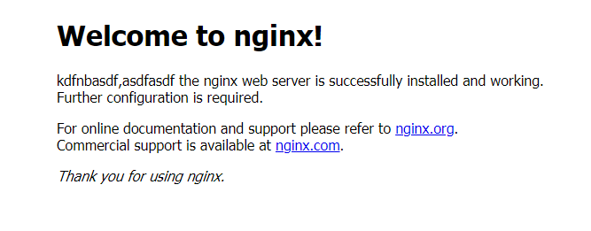

去年就买了一个阿里云服务器，自从安装了mySQL数据库也就没有去发挥它的作用了。一直也想将vue开发的一个小项目部署到服务器上，有助于以后写文章时有个链接能直接看到效果，而不是图片了。下面就记录一下nginx部署一个项目的流程。
[直入主题](http://39.108.100.163:8081)
<!-- more -->
### ubuntu安装nginx服务器
`sudo apt-get install nginx`
安装好的文件位置：

/usr/sbin/nginx：主程序

/etc/nginx：存放配置文件

/usr/share/nginx：存放静态文件

/var/log/nginx：存放日志

其实从上面的根目录文件夹可以知道，Linux系统的配置文件一般放在/etc，日志一般放在/var/log，运行的程序一般放在/usr/sbin或者/usr/bin。

当然，如果要更清楚Nginx的配置项放在什么地方，可以打开/etc/nginx/nginx.conf。

Nginx指定默认加载/etc/nginx/nginx.conf的配置文件。如果要查看加载的是哪个配置文件，可以用这个命令sudo nginx -t或者ps -ef | grep nginx。

然后通过这种方式安装的，会自动创建服务，会自动在/etc/init.d/nginx新建服务脚本，然后就可以使用sudo service nginx {start|stop|restart|reload|force-reload|status|configtest|rotate|upgrade}的命令启动。
下面是被我修改过的页面。
<div  align="center">
</div>
### vue-cli打包成静态文件
打包之前需要注意两个问题：
1.记得改一下config下面的index.js中bulid模块导出的路径。因为index.html里边的内容都是通过script标签引入的，而你的路径不对，打开肯定是空白的。先看一下默认的路径。assetsPublicPath默认的是  `/`  也就是根目录。而我们的index.html和static在同一级目录下面。所以要改为  `./ `。
2.src里边router/index.js路由配置里边默认模式是hash，如果你改成了history模式的话，打开也会是一片空白。所以改为hash或者直接把模式配置删除，让它默认的就行 。
`npm run build`生成的dist文件先在本地看一下是否有效果然后上传到github上。
### 修改nginx的配置文件
查看nginx.conf
``` json 
user www-data;
worker_processes 4;
pid /run/nginx.pid;

events {
	worker_connections 768;
	# multi_accept on;
}

http {

	##
	# Basic Settings
	##

	sendfile on;
	tcp_nopush on;
	tcp_nodelay on;
	keepalive_timeout 65;
	types_hash_max_size 2048;
	# server_tokens off;

	# server_names_hash_bucket_size 64;
	# server_name_in_redirect off;

	include /etc/nginx/mime.types;
	default_type application/octet-stream;

	##
	# Logging Settings
	##

	access_log /var/log/nginx/access.log;
	error_log /var/log/nginx/error.log;

	##
	# Gzip Settings
	##

	gzip on;
	gzip_disable "msie6";

	# gzip_vary on;
	# gzip_proxied any;
	# gzip_comp_level 6;
	# gzip_buffers 16 8k;
	# gzip_http_version 1.1;
	# gzip_types text/plain text/css application/json application/x-javascript text/xml application/xml application/xml+rss text/javascript;

	##
	# nginx-naxsi config
	##
	# Uncomment it if you installed nginx-naxsi
	##

	#include /etc/nginx/naxsi_core.rules;

	##
	# nginx-passenger config
	##
	# Uncomment it if you installed nginx-passenger
	##
	
	#passenger_root /usr;
	#passenger_ruby /usr/bin/ruby;

	##
	# Virtual Host Configs
	##

	include /etc/nginx/conf.d/*.conf;
	include /etc/nginx/sites-enabled/*;
}


#mail {
#	# See sample authentication script at:
#	# http://wiki.nginx.org/ImapAuthenticateWithApachePhpScript
# 
#	# auth_http localhost/auth.php;
#	# pop3_capabilities "TOP" "USER";
#	# imap_capabilities "IMAP4rev1" "UIDPLUS";
# 
#	server {
#		listen     localhost:110;
#		protocol   pop3;
#		proxy      on;
#	}
# 
#	server {
#		listen     localhost:143;
#		protocol   imap;
#		proxy      on;
#	}
#}
```
上面的文件重点就在这两句
`include /etc/nginx/conf.d/*.conf;`
`include /etc/nginx/sites-enabled/*;`
第二句里面放着默认配置default
``` json
server {
        listen 80 default_server;
        listen [::]:80 default_server ipv6only=on;

        root /usr/share/nginx/html;
        index index.html index.htm;

        # Make site accessible from http://localhost/
        server_name localhost;

        location / {
                # First attempt to serve request as file, then
                # as directory, then fall back to displaying a 404.
                try_files $uri $uri/ =404;
                # Uncomment to enable naxsi on this location
                # include /etc/nginx/naxsi.rules
        }
}
```
第一句文件的位置就是放自己配置的server。
先将github上的打包的dist文件拉动服务器上来。
放到下面的位置
root@iZi2m69ympwtuqZ:/var/www/dist# pwd
/var/www/dist
root@iZi2m69ympwtuqZ:/var/www/dist# ls
index.html  README.md  static 
然后在/etc/nginx/conf.d 新建一个以。conf结尾文件
root@iZi2m69ympwtuqZ:/etc/nginx/conf.d# vi vueapp.conf
具体内容
``` json
server{
        listen 8081; #监听端口
        server_name 39.109.100.163;#监听地址
        location /{
                index index.html; #默认页面
                root /var/www/dist;#根目录，也就是github拉下来文件的位置
        }
} 
```
我也就是配置最最简单的。更详细配置[查看官网](http://nginx.org/en/)
### 重启 nginx服务
`nginx -s reload`
然后[访问测试去吧](http://39.108.100.163:8081)


