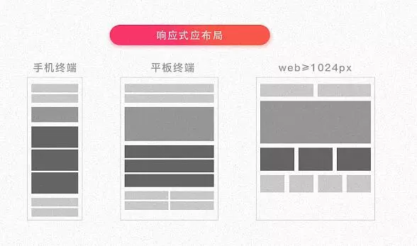

### 数据结构
1. 什么是队列、栈、链表
数组、链表、堆栈和队列是最基本的数据结构，队列就是一种先进先出的逻辑结构，栈是一种先进后出的逻辑结构。
<!-- more -->
2. 什么是树（平衡树,排序树,B树,B+树,R树,红黑树）、堆（大根堆、小根堆）、图（有向图、无向图、拓扑）
3. 栈通常采用的两种存储结构
链接存储：链栈带有头指针或头结点的单循环链表。
顺序存储：数组实现。
4. 两个栈实现队列，和两个队列实现栈
[链接答案](https://blog.csdn.net/zw_1510/article/details/51927554)

### 排序算法
#### 冒泡排序

冒泡排序是一种简单的排序方法，它的基本思想是：通过相邻两个元素之间比较和交换，使较大的元素逐渐从前面移向后面（升序），就像水底下的气泡一样逐渐向上冒泡，所以被称为“冒泡”排序。冒泡排序的最坏时间复杂度为O(n2)，平均时间复杂度为O(n2)。
``` java
 	/**
     * 排序算法
     * @param list
     */
    public static void  bubbleSort(int[] list){
        int temp;
        // 做多少轮排序（最多length-1轮）
        for (int i=0;i <list.length-1;i++){
            // 每一轮比较多少个
            for (int j=0;j<list.length-1-i;j++){
                if (list[j]>list[j+1]){
                    //交换
                    temp = list[j];
                    list[j] = list[j+1];
                    list [j+1]=temp;
                }
            }
        }
    }
```

#### 快速排序
快速排序的基本思想是：通过一轮排序将待排序元素分割成独立的两部分， 其中一部分的所有元素均比另一部分的所有元素小，然后分别对这两部分的元素继续进行快速排序，以此达到整个序列变成有序序列。快速排序的最坏时间复杂度为O(n2)，平均时间复杂度为O(n*log2n)   
``` java
	/**
     * 快速排序算法
     */
    public static void quickSort(int[] list, int left, int right) {
        if (left < right) {
            // 分割数组，找到分割点
            int point = partition(list, left, right);

            // 递归调用，对左子数组进行快速排序
            quickSort(list, left, point - 1);
            // 递归调用，对右子数组进行快速排序
            quickSort(list, point + 1, right);
        }
    }

    /**
     * 分割数组，找到分割点
     */
    public static int partition(int[] list, int left, int right) {
        // 用数组的第一个元素作为基准数
        int first = list[left];
        while (left < right) {
            while (left < right && list[right] >= first) {
                right--;
            }
            // 交换
            swap(list, left, right);

            while (left < right && list[left] <= first) {
                left++;
            }
            // 交换
            swap(list, left, right);
        }
        // 返回分割点所在的位置
        return left;
    }

    /**
     * 交换数组中两个位置的元素
     */
    public static void swap(int[] list, int left, int right) {
        int temp;
        if (list != null && list.length > 0) {
            temp = list[left];
            list[left] = list[right];
            list[right] = temp;
        }
    }

```

#### 直接选择排序
直接选择排序(Straight Select Sort) 是一种简单的排序方法，它的基本思想是：通过length-1 趟元素之间的比较，从length-i+1个元素中选出最小的元素，并和第i个元素交换位置。直接选择排序的最坏时间复杂度为O(n2)，平均时间复杂度为O(n2)

``` java
	/**
     * 直接选择排序算法
     */
    public static void selectionSort(int[] list) {
        // 要遍历的次数（length-1次）
        for (int i = 0; i < list.length - 1; i++) {
            // 将当前下标定义为最小值下标
            int min = i;

            // 遍历min后面的数据
            for (int j = i + 1; j <= list.length - 1; j++) {
                // 如果有小于当前最小值的元素，将它的下标赋值给min
                if (list[j] < list[min]) {
                    min = j;
                }
            }
            // 如果min不等于i，说明找到真正的最小值
            if (min != i) {
                swap(list, min, i);
            }
        }
    }

    /**
     * 交换数组中两个位置的元素
     */
    public static void swap(int[] list, int min, int i) {
        int temp = list[min];
        list[min] = list[i];
        list[i] = temp;
    }
```
#### 堆排序
堆排序(Heap Sort) 利用堆（一般为大根堆）进行排序的方法。它的基本思想是：将待排序的元素构造成一个大根堆。此时，整个序列的最大值就是堆顶的根节点。将它移走（其实就是将它与数组的末尾元素进行交换，此时末尾元素就是最大值），然后将剩余的length-1 个元素重新构造成一个大根堆，这样就会得到length个元素中的次大值。如此反复执行，便能得到一个有序的序列。

堆是具有下列性质的完全二叉树：每个节点的值都大于或等于其左右孩子节点的值，称为大根堆；每个节点的值都小于或等于其左右孩子节点的值，称为小根堆。

堆排序的最坏时间复杂度为O(n*log2n)，平均时间复杂度为O(n*log2n) 
``` java
	/**
     * 堆排序算法
     */
    public static void heapSort(int[] list) {
        // 将无序堆构造成一个大根堆，大根堆有length/2个父节点
        for (int i = list.length / 2 - 1; i >= 0; i--) {
            headAdjust(list, i, list.length);
        }

        // 逐步将每个最大值的根节点与末尾元素交换，并且再调整其为大根堆
        for (int i = list.length - 1; i > 0; i--) {
            // 将堆顶节点和当前未经排序的子序列的最后一个元素交换位置
            swap(list, 0, i);
            headAdjust(list, 0, i);
        }
    }

    /**
     * 构造大根堆
     */
    public static void headAdjust(int[] list, int parent, int length) {
        // 保存当前父节点
        int temp = list[parent];

        // 得到左孩子节点
        int leftChild = 2 * parent + 1;

        while (leftChild < length) {
            // 如果parent有右孩子，则要判断左孩子是否小于右孩子
            if (leftChild + 1 < length && list[leftChild] < list[leftChild + 1]) {
                leftChild++;
            }
            // 父亲节点大于子节点，就不用做交换
            if (temp >= list[leftChild]) {
                break;
            }
            // 将较大子节点的值赋给父亲节点
            list[parent] = list[leftChild];
            // 然后将子节点做为父亲节点
            parent = leftChild;
            // 找到该父亲节点较小的左孩子节点
            leftChild = 2 * parent + 1;
        }
        // 最后将temp值赋给较大的子节点，以形成两值交换
        list[parent] = temp;
    }

    /**
     * 交换数组中两个位置的元素
     */
    public static void swap(int[] list, int top, int last) {
        int temp = list[top];
        list[top] = list[last];
        list[last] = temp;
    }

```
#### 直接插入排序
直接插入排序的基本思想是：每次从无序序列中取出第一个元素插入到已经排好序的有序序列中，从而得到一个新的，数量加1的有序序列。
``` java
	/**
     * 直接插入排序算法
     */
    public static void insertSort(int[] list) {
        // 从无序序列中取出第一个元素 (注意无序序列是从第二个元素开始的)
        for (int i = 1; i < list.length; i++) {
            int temp = list[i];
            int j;
            // 遍历有序序列
            // 如果有序序列中的元素比临时元素大，则将有序序列中比临时元素大的元素依次后移
            for (j = i - 1; j >= 0 && list[j] > temp; j--) {
                list[j + 1] = list[j];
            }
            // 将临时元素插入到腾出的位置中
            list[j + 1] = temp;
        }
    }

```

### 一些概念常识
#### 深拷贝和浅拷贝
浅复制 —-只是拷贝了基本类型的数据，而引用类型数据，复制后也是会发生引用，我们把这种拷贝叫做“（浅复制）浅拷贝”，换句话说，浅复制仅仅是指向被复制的内存地址，如果原地址中对象被改变了，那么浅复制出来的对象也会相应改变。

深复制 —-在计算机中开辟了一块新的内存地址用于存放复制的对象。
浅拷贝实例
``` javascript 
//此递归方法不包含数组对象
var obj = { a:1, arr: [2,3] };
var shallowObj = shallowCopy(obj);

function shallowCopy(src) {
  var newobj = {};
  for (var prop in src) {
    if (src.hasOwnProperty(prop)) {
      newobj[prop] = src[prop];
    }
  }
  return newobj;
}
```
导致的结果就是：
shallowObj.arr[1] = 5;
console.log(obj.arr[1]);   //  5
深拷贝实例
``` javascript
var obj = { 
    a:1, 
    arr: [1,2]，
    nation : '中国',
    birthplaces:['北京','上海','广州']
};
var obj2 = {name:'杨'};
obj2 = deepCopy(obj,obj2);
console.log(obj2);
//深复制，要想达到深复制就需要用递归
function deepCopy(o,c){
   var c = c || {}；
   for(var i in o){
   if(typeof o[i] === 'object'){
          //要考虑深复制问题了
          if(o[i].constructor === Array){
            //这是数组
            c[i] =[]；
          }else{
            //这是对象
            c[i] = {}；
          }
          deepCopy(o[i],c[i])；
        }else{
          c[i] = o[i]；
        }
     }
     return c
 }
```
#### 线程与进程
`进程`：一个程序是静态的，通常是存放在外存中的。而当程序被调入内存中运行后，就成了进程。
`线程`：一个进程内部可能包含了很多顺序执行流，每个顺序执行流就是一个线程。`多线程`就是有多条顺序执行流“同时”[并发]执行，且它们之间互不干扰。
两者的区别：一个程序至少有一个进程,一个进程至少有一个线程。多线程的意义在于一个应用程序中，有多个执行部分可以同时执行。来实现进程的调度和管理以及资源分配。

#### 阻塞与非阻塞
阻塞和非阻塞这两个概念与程序（线程）等待消息通知(无所谓同步或者异步)时的状态有关。也就是说阻塞与非阻塞主要是程序（线程）等待消息通知时的状态角度来说的。
`阻塞`调用是指调用结果返回之前，当前线程会被挂起，一直处于等待消息通知，不能够执行其他业务。函数只有在得到结果之后才会返回。
`非阻塞`指在不能立刻得到结果之前，该函数不会阻塞当前线程，而会立刻返回。

#### 同步与异步
`同步`:所谓同步就是一个任务的完成需要依赖另外一个任务时，只有等待被依赖的任务完成后，依赖的任务才能算完成，这是一种可靠的任务序列。要么成功都成功，失败都失败，两个任务的状态可以保持一致。
`异步`: 异步是不需要等待被依赖的任务完成，只是通知被依赖的任务要完成什么工作，依赖的任务也立即执行，只要自己完成了整个任务就算完成了。至于被依赖的任务最终是否真正完成，依赖它的任务无法确定，所以它是不可靠的任务序列。
`消息通知`: 异步的概念和同步相对。当一个同步调用发出后，调用者要一直等待返回消息（结果）通知后，才能进行后续的执行；当一个异步过程调用发出后，调用者不能立刻得到返回消息（结果）。实际处理这个调用的部件在完成后，通过状态、通知和回调来通知调用者。

#### http
##### 请求
http请求包含有请求头，请求行，请求正文。
``` javascript
axios({
  method: 'post',
  url: '/user/12345',
  headers:{
    'Content-Type':'application/x-www-form-urlencoded'  
  },
  data: {
    firstName: 'Fred',
    lastName: 'Flintstone'
  }
});
```
method和url就是这个请求的请求行（这里是请求行部分信息，其实请求行还包括http协议的版本等信息）。headers中的属性就是请求头，里面的属性，全部包含在请求的header里面，是服务端获取客户端版本，缓存等信息的一个途径。data对应的就是请求正文，也就是平常所说的参数。
##### 响应
在请求发出去，并且响应已经回来的时候，就时候信息可分为响应行，响应头，响应正文。
`响应行`:返回请求的http协议及版本，状态码，请求状态等描述信息。
`响应头`:响应头和请求头格式一致，返回版本，缓存等信息。
`响应正文`:也就是日常开发需要用到的数据。
##### 常见的HTTP相应状态码
200：请求成功
400：参数错误
403：拒绝或者禁止访问（无权限访问）
404：地址不存在
405：客户端请求中的方法被禁止（一般是请求方式错误）
500：服务器报错
502：请求超时，无效网关
503：服务器超载或者维护，无法响应
##### https
HTTPS=数据加密+网站认证+完整性验证+HTTP
#### 响应式和自适应
响应式：一个网页，根据屏幕的宽度的改变而展示不同的效果，代码基本是两套以上。在所有屏幕上都展示很好的效果，但是设计，开发成本高。
<div  align="center">
</div>
自适应：一个网页，根据屏幕宽度的改变而改变。代码只有一套。在个别的屏幕上，排版这个比较丑，但是设计，开发成本低。
<div  align="center">
</div>


